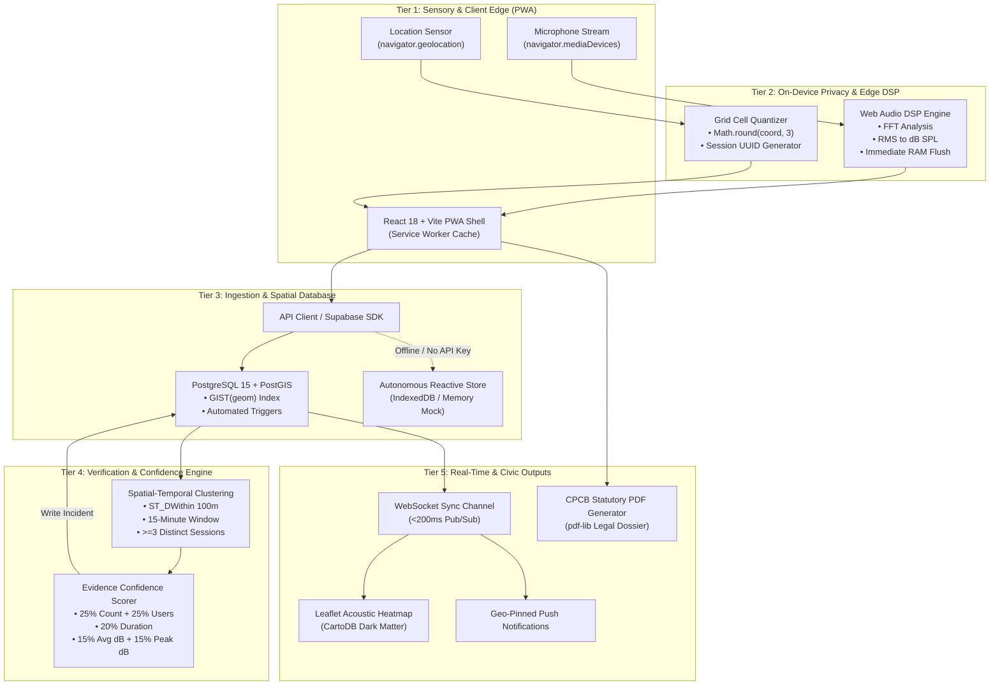
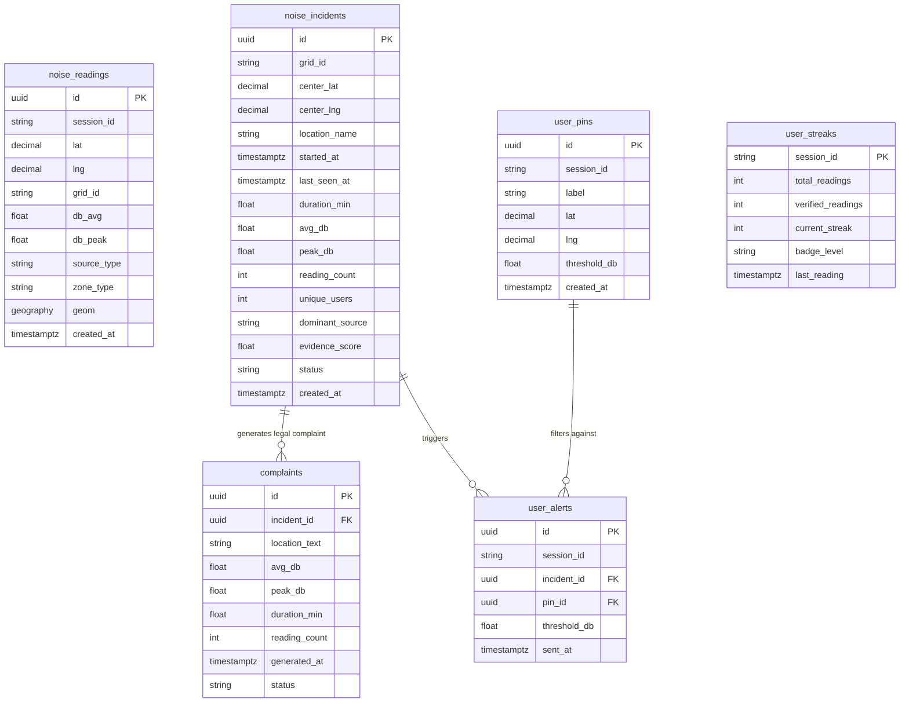

# NoiseMap — System Architecture Document

**Project:** NoiseMap — Privacy-First, Real-Time Noise Pollution Mapping and Reporting PWA  
**Team:** Wave Builders (Aman Tyagi · Abhishek Sharma · Abhishek Bharadwaj)  
**Track:** Open Innovation Track · Privacy-First Environmental Intelligence  
**Hackathon:** Hackyard Build 2026, IIT Guwahati  
**Core Pipeline:** `MEASURE` → `MAP` → `VERIFY` → `ALERT` → `ACT`

---

## 1. System Overview & Architectural Principles

NoiseMap is an open-standard, zero-install civic intelligence platform engineered to transform consumer smartphones into an active acoustic sensor network. The platform adheres to three uncompromising architectural pillars:

1. **Zero-Audio Edge Privacy:** No raw audio buffer ever leaves user device RAM. Audio captured via the HTML5 Web Audio API undergoes on-device Fast Fourier Transform (FFT) and Root Mean Square (RMS) decibel calculation before the stream is permanently discarded.
2. **Mathematical Location Quantization:** User GPS coordinates are rounded client-side to 3 decimal places (~100m grid cell) before network transit. No precise residential or room-level coordinates are stored or transmitted.
3. **Algorithmic Peer Corroboration:** Individual reports are treated as anecdotal. The Incident Engine promotes noise spikes to a **Verified Noise Incident** only when **3+ distinct session tokens** detect noise exceeding statutory thresholds in the same 100m grid cell within a sliding **15-minute window**.

---

## 2. 5-Tier Reactive System Architecture

---

## 3. Database Architecture & Schema (PostgreSQL 15 + PostGIS)

The database schema is comprised of 6 strongly typed tables optimized for spatial queries and realtime pub/sub:

### Table Definitions & Geospatial Triggers
1. **`noise_readings`:** Stores individual anonymous readings with a generated `grid_id` (`ROUND(lat, 3) || '_' || ROUND(lng, 3)`) and a `geom` point indexed with GIST for spatial indexing.
2. **`noise_incidents`:** Stores clustered and corroborated noise events with active evidence scores and duration tracking.
3. **`user_pins`:** Stores user-monitored locations (e.g. Home, School, Hospital) and alert thresholds.
4. **`complaints`:** Audit logs of generated statutory CPCB violation dossiers.
5. **`user_streaks`:** Anonymous gamification tracking (Badges: *Noise Watcher*, *Community Sensor*, *Noise Guardian*).
6. **`user_alerts`:** Historical log of notifications dispatched to users when incidents breached their pinned thresholds.

---

## 4. Algorithmic Evidence Confidence Scoring Model

To transform scattered noise data into legally robust civic evidence, each incident is scored continuously using the mathematical weighting formula:

$$\text{Evidence Confidence} = w_1 \cdot C_{\text{count}} + w_2 \cdot C_{\text{users}} + w_3 \cdot C_{\text{duration}} + w_4 \cdot C_{\text{avg}} + w_5 \cdot C_{\text{peak}}$$

Where weights are calibrated as follows:
- **Sample Count ($w_1 = 25\%$):** Density of readings collected within the spatial cell (normalized up to 20 readings).
- **Unique Contributors ($w_2 = 25\%$):** Number of independent session tokens (normalized: $\ge 5$ tokens = $100\%$).
- **Incident Duration ($w_3 = 20\%$):** Persistence of violation across time (normalized: $\ge 45$ minutes = $100\%$).
- **Average Decibel Severity ($w_4 = 15\%$):** Excess over legal limit ($55\,\text{dB}$ residential day, $45\,\text{dB}$ residential night).
- **Peak Decibel Impact ($w_5 = 15\%$):** Acute impulse spikes ($>85\,\text{dB}$ reaches maximum score).

---

## 5. CPCB Statutory Compliance & Evidence Dossier

NoiseMap maps directly to the **Noise Pollution (Regulation and Control) Rules, 2000** issued under the Environment (Protection) Act, 1986.

| Area Category | Day Limit (6:00 AM – 10:00 PM) | Night Limit (10:00 PM – 6:00 AM) | NoiseMap Zone Color |
|---|---|---|---|
| **Silence Zone** | $50\,\text{dB(A)}$ | $40\,\text{dB(A)}$ | Green if under, Orange if breached |
| **Residential Area** | $55\,\text{dB(A)}$ | $45\,\text{dB(A)}$ | Yellow / Orange |
| **Commercial Area** | $65\,\text{dB(A)}$ | $55\,\text{dB(A)}$ | Orange |
| **Industrial Area** | $75\,\text{dB(A)}$ | $70\,\text{dB(A)}$ | Red if $>75\,\text{dB}$ |

The client-side `pdf-lib` generator embeds:
- Official Reference Number: `CPCB-NM-2026-[RANDOM_HEX]`
- Reverse geocoded landmark & grid coordinates
- Start, end, and duration timestamps
- Contributor count and verified confidence percentage
- Time-series decibel curve graph
- Statutory citations citing Section 5 & 7 of the 2000 Rules.

---

## 6. UI/UX Aesthetic Architecture & Design System (Zajno Retro-Vector & Precision HUD)

Taking explicit design cues from high-end technical design systems (specifically **Zajno's Superlinked Open-Source vector infrastructure design**), NoiseMap avoids generic corporate dashboard templates or cookie-cutter AI cards. Instead, it embodies a bespoke **Retro-Vector Computing & Precision Acoustic Instrument** aesthetic:

### A. Visual Foundation & Color Palette
* **Base Infrastructure Slate:** `#0B0F17` (Deep Obsidian Void), `#111827` (Card Surface), `#182234` (Elevated Panel)
* **Oxidized Phosphor & Terminal Accents:**
  * **Amber-Orange Glow:** `#F59E0B` / `#D97706` (Evoking vintage CRT displays & oxidized copper)
  * **Phosphor Cyan / Radar Beam:** `#00F2FE` / `#06B6D4` (High-precision spatial scanning)
  * **Acoustic Emerald:** `#10B981` (Safe zone / low decibel baseline)
  * **Alert Crimson / Impulse Shock:** `#EF4444` (Statutory violation threshold)
* **Subtle Vector Coordinate Grids:** Fine background hairline grids (`rgba(255,255,255,0.04)`) with crosshair corner registration marks (`+`) evoking precision laboratory oscilloscopes and vector machines.

### B. Typography & Data Density
* **Headings & Badges:** Monospace / Technical Sans (`JetBrains Mono` / `Inter` / `Space Grotesk`) with micro-labels (`[01.MEASURE]`, `[SYS_OK]`, `LAT: 26.144°N`).
* **Numeric Displays:** Tabular numerals with glowing phosphor drop-shadows for real-time decibel fluctuation without UI layout shift.

### C. Kinetic Animations & Tactile Controls
* **Vector Oscilloscope Waveform:** Real-time HTML5 Canvas rendering of the ambient audio wave with glowing neon line traces and decay phosphor trails.
* **Scanning Radar Sweep:** Concentric range rings with a rotating 360° sweeping beam on the map when tracking live acoustic nodes.
* **Micro-Tactile Interactions:** Clickable mechanical spring response, subtle glow blurs on card borders, and smooth numerical interpolation counters.
* **Tactical Floating Demo Simulator HUD:** A docked, collapsible control deck styled as a field-tester terminal for judges to stress-test consensus clustering on the fly.
