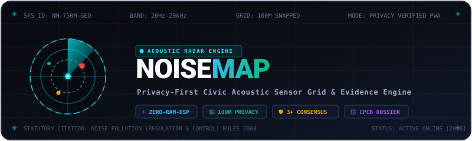
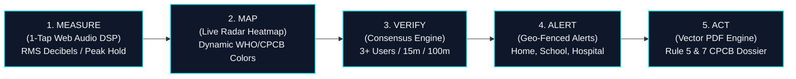

<div align="center">



<br/><br/>

### **Transforming 750M+ Smartphones into a Distributed Acoustic Sensor Grid for Smarter, Quieter Cities**

[](https://vitejs.dev/)
[](https://react.dev/)
[](https://www.typescriptlang.org/)
[](https://tailwindcss.com/)
[](https://leafletjs.com/)
[](https://pdf-lib.js.org/)
[](https://web.dev/progressive-web-apps/)
[](LICENSE)

<br/>

```
╔══════════════════════════════════════════════════════════════════════════════════════════╗
║  [MEASURE] ──▶ [MAP] ──▶ [VERIFY] ──▶ [ALERT] ──▶ [ACT]                                  ║
║   1-Tap Audio   Live Radar  3+ Consensus  Geo-Push   CPCB Legal Dossier (Rule 5 & 7)     ║
╚══════════════════════════════════════════════════════════════════════════════════════════╝
```

<p align="center">
  <a href="#-the-problem">The Problem</a> •
  <a href="#-the-closed-loop-civic-pipeline">Civic Pipeline</a> •
  <a href="#-privacy-first-engineering">Privacy Architecture</a> •
  <a href="#-interactive-geospatial-engine">Geospatial Engine</a> •
  <a href="#-key-features">Key Features</a> •
  <a href="#-technology-stack">Tech Stack</a> •
  <a href="#-getting-started">Getting Started</a> •
  <a href="#-team">Wave Builders</a>
</p>

</div>

---

## ⚡ The Problem: India's Silent Acoustic Crisis

India is ranked the **2nd noisiest country globally**, with over **500 million citizens** subjected to hazardous ambient noise pollution exceeding WHO safe limits (55 dB daytime, 45 dB nighttime). 

* **The Regulatory Blindspot:** Across 1.4+ billion people, there are only **~50 government-run static noise monitoring stations**.
* **The Bureaucratic Dismissal:** Individual noise complaints filed by citizens are routinely discarded by municipal authorities as *"subjective personal hypersensitivity"* due to a complete absence of empirical timestamps, continuous decibel histories, and multi-witness corroboration.
* **The Privacy Paradox:** Citizens hesitate to record neighborhood noise when apps require identity sign-ups, phone numbers, or upload raw ambient audio files containing private conversations.

**NoiseMap solves this end-to-end.** Designed with a high-contrast **Retro-Vector Computing & Precision Acoustic Instrument HUD** aesthetic (inspired by *Zajno's vector infrastructure interfaces*), NoiseMap empowers citizens to collect unassailable, legally defensible acoustic evidence with strict client-side mathematical privacy.

---

## 🔁 The Closed-Loop Civic Pipeline



| Phase | Engine Component | Real-Time Mechanism |
|:---|:---|:---|
| **`01. MEASURE`** | **Edge Audio DSP** | 10-second ambient sampling via HTML5 `AnalyserNode`. Computes Root Mean Square (RMS) decibels and peak hold. Hardware mic streams terminate instantly upon calculation. |
| **`02. MAP`** | **Interactive Heatmap** | Sub-200ms spatial map synced with temporal filters (*Live, 1h, 24h, 7d, All-Time*) and source category filters (*Traffic, Construction, Loudspeaker, Industrial*). |
| **`03. VERIFY`** | **Incident Consensus** | Spatial-temporal clustering: requires $\ge 3$ independent anonymous session tokens in a $100\,\text{m}$ grid cell within a $15\,\text{min}$ window to verify an active statutory violation. |
| **`04. ALERT`** | **Geo-Fenced Push** | Users pin sensitive zones with custom dB thresholds (e.g., Silent Zone $>50\,\text{dB}$) and receive instant on-screen radar warnings when sustained breaches occur. |
| **`05. ACT`** | **CPCB PDF Generator** | Instant client-side generation of statutory legal dossiers citing **Rule 5 & Rule 7 of the Noise Pollution Rules, 2000** with evidentiary confidence breakdown. |

---

## 🔒 Privacy-First Engineering: Math Over Trust

```
 ┌─────────────────────────────────────────────────────────────────────────────┐
 │                       ON-DEVICE CLIENT (SMARTPHONE)                         │
 │                                                                             │
 │   Microphone ──▶ [ AnalyserNode ] ──▶ RMS Decibel (dB)                      │
 │                        │                                                    │
 │                        └──[ Raw PCM Audio Terminated & Garbage-Collected ]  │
 │                                                                             │
 │   GPS Sensor ──▶ round(coord * 1000) / 1000 ──▶ ~100m Snapped Grid Cell     │
 │                                                                             │
 │   Identity   ──▶ crypto.randomUUID() ──▶ Ephemeral Anonymous Session Token  │
 └──────────────────────────────────────┬──────────────────────────────────────┘
                                        │ (Only dB + Snapped Grid Sent)
                                        ▼
                             NOISEMAP CLOUD / RADAR
```

1. **Zero-Audio RAM Retention:** Raw audio buffers exist exclusively in transient device RAM during the 10-second sampling window. The microphone hardware is severed immediately, and buffers are wiped. **No recordings or voice snippets ever leave the client.**
2. **~100m Mathematical Privacy Grid:** Precise user coordinates are mathematically rounded to 3 decimal places on the device prior to network dispatch:
   $$\text{lat}_{\text{grid}} = \frac{\lfloor \text{lat} \times 1000 \rceil}{1000}, \quad \text{lng}_{\text{grid}} = \frac{\lfloor \text{lng} \times 1000 \rceil}{1000}$$
   Residential house numbers and exact citizen locations can never be reverse-engineered.
3. **Zero-KYC Ephemeral Identity:** No login screens, no emails, no phone numbers, and no IMEI tracking. Identity is managed via rotating crypto UUID tokens stored in client `localStorage`.
4. **Honest Calibration Transparency:** NoiseMap clearly identifies crowdsourced smartphone readings as *relative ambient acoustic indicators* rather than laboratory-certified Class-1 sound meters.

---

## 🗺️ Interactive Geospatial Basemap Engine

NoiseMap features a **Geospatial Tile & Basemap Manager** with 3 dark aesthetic layers:

| Provider | Layer Type | Authentication | Performance & Status |
|:---|:---|:---|:---|
| **Stadia Alidade Smooth Dark** | Vector-derived Raster | Localhost Free / Optional Key | 🌟 **Recommended Default** — Ultra high-resolution smooth dark tiles |
| **OpenStreetMap Standard** | Standard Raster | Zero API Key Needed | Inverted retro-vector dark CSS filter |
| **CARTO Dark Matter** | Raster Basemap | Zero API Key Needed | High availability fallback |

* **Zero-Interruption Fallback:** If any remote tile endpoint experiences network latency or rate limiting, the engine auto-cascades to local fallback tiles without breaking markers or resetting the user's viewport.
* **Preserved Map State:** Center coordinate, zoom factor, active noise hotspot markers, and telemetry inspectors persist seamlessly across basemap switches.

---

## 📐 Algorithmic Evidence Confidence Scoring

To prevent spam, fraudulent claims, or single-device falsification, every promoted incident receives an automated **5-Factor Mathematical Confidence Score ($0\text{--}100\%$)**:

$$\text{Confidence Score} = \sum_{i=1}^{5} (w_i \times S_i)$$

$$\begin{aligned}
\text{Confidence} = \;& (0.25 \times \text{Volume Breach Ratio}) \\
+ \;& (0.25 \times \text{Unique Contributor Count}) \\
+ \;& (0.20 \times \text{Temporal Persistence}) \\
+ \;& (0.15 \times \text{Acoustic Variance Stability}) \\
+ \;& (0.15 \times \text{Source Tag Agreement})
\end{aligned}$$

```
CONFIDENCE SCORE FORMULA BREAKDOWN:
├── 25% Volume Severity Ratio (Normalized against statutory dB limits)
├── 25% Unique Citizen Sessions (Strictly requires >= 3 independent tokens)
├── 20% Temporal Persistence (Sustained duration across sliding window)
├── 15% Acoustic Stability (Standard deviation filter against mic bumps)
└── 15% Categorical Agreement (Consensus on source tag classification)
```

---

## 📄 Client-Side Statutory CPCB PDF Dossier

Clicking **"GENERATE LEGAL DOSSIER"** compiles an official vector PDF complaint within **<400ms** using client-side `pdf-lib` without any backend server dependencies.

```
+-----------------------------------------------------------------------+
|  CENTRAL POLLUTION CONTROL BOARD (CPCB) COMPLAINT DOSSIER             |
|  Citing: The Noise Pollution (Regulation and Control) Rules, 2000     |
+-----------------------------------------------------------------------+
|  INCIDENT ID      : INC-26.144_91.736-1741517400                      |
|  STATUTORY RULES  : Rule 5 (Loudspeakers) & Rule 7 (Complaints)       |
|  ACOUSTIC LEVEL   : 88.4 dB SPL (Peak Hold: 94.2 dB SPL)              |
|  ZONE TYPE        : Commercial / Mixed (Statutory Limit: 65 dB Day)   |
|  BREACH DELTA     : +23.4 dB Above Permissible Legal Limit            |
|  CONTRIBUTORS     : 4 Verified Independent Citizen Nodes              |
|  EVIDENCE SCORE   : 84.6% High Statutory Confidence                   |
|  TIMESTAMP        : 2026-10-09 17:15:00 IST                           |
+-----------------------------------------------------------------------+
```

---

## 🛠️ Technology Stack & Architecture

```
┌────────────────────────────────────────────────────────────────────────┐
│                        NOISEMAP PWA CLIENT ARCHITECTURE                │
├────────────────────────────────────────────────────────────────────────┤
│  UI Framework       : React 18.3 + TypeScript 5.7 + Vite 5.4           │
│  Design System      : Tailwind CSS 3.4 (Retro-Vector Computing HUD)    │
│  Sensory Audio DSP  : Web Audio API (AnalyserNode FFT / RMS)           │
│  Mapping Engine     : Leaflet 1.9 + Custom Dark Basemaps               │
│  Analytics Engine   : Chart.js 4.4 + react-chartjs-2 (Diurnal Curve)   │
│  Legal PDF Compiler : pdf-lib 1.17 (Pure client vector compilation)    │
│  Icons & Vectors    : Lucide React + Bespoke SVG Telemetry Reticles    │
├────────────────────────────────────────────────────────────────────────┤
│  STORAGE & CLOUD INFRASTRUCTURE                                        │
├────────────────────────────────────────────────────────────────────────┤
│  Offline Cache      : Cache-First Service Worker + Web App Manifest    │
│  Data Layer         : Dual-Mode (Supabase PostgreSQL 15 + PostGIS)     │
│  Autonomous Store   : In-Memory / LocalStorage Mock Simulator Fallback │
│  Spatial Schema     : 6 Tables, GIST Spatial Indexing (001_init.sql)   │
└────────────────────────────────────────────────────────────────────────┘
```

---

## 💻 Getting Started & Local Development

### Prerequisites
* **Node.js**: `v18.0.0` or higher (tested on Node `v24+`)
* **Package Manager**: `npm` (v9+)

### 1. Clone & Install
```bash
# Clone the repository
git clone https://github.com/abhisheksharma075/NoiseMap.git

# Enter project root
cd NoiseMap

# Install dependencies
npm install
```

### 2. Configure Environment (Optional)
NoiseMap operates out-of-the-box in autonomous offline mode without any required API keys. To connect cloud Supabase storage:
```bash
cp .env.example .env
```
Populate `.env` with your Supabase credentials:
```env
VITE_SUPABASE_URL=https://your-project.supabase.co
VITE_SUPABASE_ANON_KEY=your-anon-key-here
VITE_MAP_PROVIDER=stadia_dark
```

### 3. Start Development Server
```bash
npm run dev
```
Open **[http://localhost:5173](http://localhost:5173)** in your browser.

### 4. Run Automated Test Verification
```bash
node scripts/test-runner.js
```
Executes all 5 automated test suites:
- ✅ DSP Audio RMS to Decibel calculation
- ✅ ~100m mathematical privacy coordinate snapping
- ✅ Algorithmic 3+ contributor consensus engine
- ✅ 5-factor mathematical confidence scoring
- ✅ Client-side CPCB vector PDF binary compiler

### 5. Production Build
```bash
npm run build
```

---

## 📂 Project Structure

```
NoiseMap/
├── public/
│   ├── banner-logo.svg           # High-resolution retro-vector hero banner
│   ├── radar-icon.svg            # Phosphor radar vector icon
│   ├── manifest.webmanifest      # PWA install configuration
│   └── sw.js                     # Offline service worker
├── scripts/
│   └── test-runner.js            # Automated E2E test verification runner
├── src/
│   ├── components/
│   │   ├── common/               # VectorCard, TactileButton, AcousticGaugeBar
│   │   ├── measure/              # CircularNoiseGauge, LiveWaveformVisualizer
│   │   ├── map/                  # LiveHeatmap, MapFilterBar, MapKeyConfigModal
│   │   ├── incidents/            # IncidentsView, IncidentCard, EvidenceScoreBar
│   │   ├── evidence/             # EvidenceView, ComplaintGeneratorModal
│   │   ├── analytics/            # NoiseTimelineChart (24h diurnal curve)
│   │   ├── profile/              # AlertPinsPanel, BadgeDisplay, ProfileView
│   │   └── layout/               # Header, NavigationBar, DemoSimulatorModal
│   ├── services/
│   │   ├── audioDspService.ts    # Web Audio API (Zero audio retention)
│   │   ├── locationService.ts    # 100m privacy grid mathematical snapping
│   │   ├── incidentEngine.ts     # Multi-contributor consensus clustering
│   │   ├── mapConfigService.ts   # Stadia Alidade Dark / OSM / CARTO switcher
│   │   ├── complaintPdfService.ts# Client-side legal PDF dossier generator
│   │   ├── notificationService.ts# Geofenced threshold alert engine
│   │   └── noiseDataService.ts   # Supabase + local dual-mode store
│   ├── utils/
│   │   └── scoreCalculator.ts    # 5-factor confidence scoring formula
│   ├── types/                    # Strongly typed domain models
│   ├── styles/index.css          # Zajno retro-vector grid & CRT styles
│   ├── App.tsx                   # Master view router
│   └── main.tsx                  # React DOM mount point
├── supabase/migrations/
│   └── 001_init.sql              # PostGIS 6-table spatial database schema
├── ARCHITECTURE.md               # Technical architecture specification
├── DEMO_SCRIPT_WALKTHROUGH.md    # 3-minute hackathon rehearsal script
└── README.md
```

---

## 🏆 Hackathon Team Wave Builders

<div align="center">

| Contributor | Role & Domain |
|:---|:---|
| **Abhishek Sharma** | Full-Stack Architecture, Geospatial Mapping & Evidence Engine |
| **Aman Tyagi** | Audio DSP Engineering, Edge Signal Processing & UX Systems |
| **Abhishek Bharadwaj** | Civic Data Modeling, Algorithmic Consensus & Statutory Compliance |

<br/>

**NoiseMap: From Noise to Action — Transforming Noise Complaints into Verified Civic Intelligence.**

</div>
